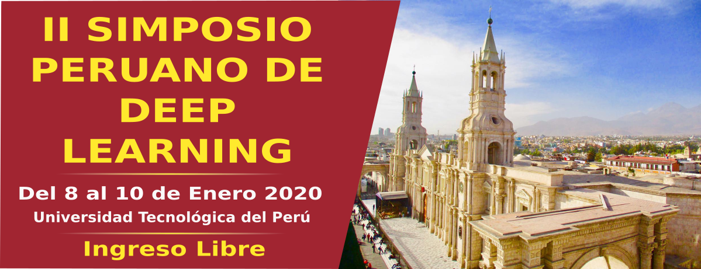

# II Simposio Peruano de Deep Learning

Contenido del "II Simposio Peruano de Deep Learning (SPDL)”, el cual fue realizado del 08 al 10 de enero en la ciudad de Arequipa, Perú.

Se llevaron a cabo las siguientes actividades:

- Presentación de tutoriales, por parte de especialistas en el área.
- Presentación de trabajos de investigación con tópicos relacionados a deep learning.
- Talleres prácticos.

## Presentaciones

### Día 1

Tema  | Slides | Video
-----| :-: | :-: |
Introduction to Convolutional Neural Networks |  | 
Deep Learning for Natural Language Processing |  | 
Introduction to Deep Reinforcement Learning |  | 
Generative Models - Variational Autoencoders |  | 

### Día 2

Algunas presentaciones no se encuentran disponible por petición de los autores.

Tema  | Slides | Video
-----| :-: | :-: |
Monocular Vision-Based Hydrological Object Detection using Deep Learning |  | `None`
GANs para Traducción de Imágenes |  | `None`
Generative models for unsupervised detection in medical images | `None` | `None`
Improving Self-supervised Depth Estimation with Feature Sharing and Depth Consistency |  | `None`
Automatic Gun Detection using Fast-RCNN on extreme illumination conditions |  | `None`
Detección Automática Personalizada de la Intensidad del Dolor de Expresiones Faciales en Vídeo usando Aprendizaje Profundo y Modelos Gráficos Probabilísticos | `None` | `None`

### Día 3

Algunas presentaciones no se encuentran disponible por petición de los autores.

Tema  | Slides | Video
-----| :-: | :-: |
Sistema Adaptativo para la Detección de Somnolencia en Conductores de Transporte |  | 
Visualization for Machine Learning | `None` | 
Interpretability Machine Learning |  | 
Aging Memories Generate More Fluent Dialogue Responses with Memory Networks | `None` | `None`
3D Point Cloud Matching |  | `None`
Invariancia Perceptual | `None` | 

Playlist con videos de las presentaciones las pueden encontrar en nuestro canal de [youtube](https://www.youtube.com/watch?v=qc7EOmkWEPQ&list=PLQ6A_QYs0VOVVFmuuBbUG61nCOw6-dTbt).

## Talleres

Tema  | Código |
------|-------|
Convolutional Neural Networks | 
Generative Adversarial Networks | 

____

Mayor información del evento: https://sites.google.com/view/spdl-2020/  
Únete a nuestra comunidad: https://www.facebook.com/MLDLMeetupAQP/
